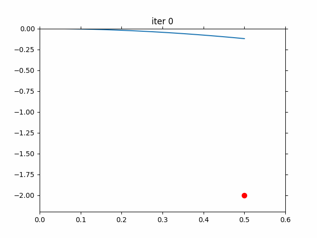

# Introduction

1. A PDE-constrained problem can be stated as :

   $$
   \min_p f(x, p) \\

   \text{s.t.} g(x, p) = 0 \\
   $$

   where $g(x, p)$ is a PDE or sometimes an ODE.

2. And `adjoint method` is a powerful framework or scheme to solve it. A good introduction is [This tutorial](https://cs.stanford.edu/~ambrad/adjoint_tutorial.pdf)

3. In this repo, I try to give some basic showcases of `adjoint method` on REAL optimization problem.

# Usage

1. `nonlinear_constraint.py` solves a optimization problem with nonlinear constraint.
2. `pde_1order_constraint.py` solves an constrained optimization with first-order ode. You can run it and get:
   ```
   iter 0 cur p -0.08575 x_final -0.50000 energy 12.25000, dfdp 0.85750
   iter 10 cur p -1.08004 x_final -0.63912 energy 11.29554, dfdp 1.12740
   iter 20 cur p -2.44796 x_final -0.91718 energy 9.50380, dfdp 1.60945
   iter 30 cur p -4.48714 x_final -1.64747 energy 5.53439, dfdp 2.42345
   iter 40 cur p -6.66131 x_final -3.47684 energy 0.27370, dfdp 1.22605
   iter 50 cur p -6.94883 x_final -3.99213 energy 0.00006, dfdp 0.02138
   iter 60 cur p -6.95244 x_final -3.99992 energy 0.00000, dfdp 0.00021
   iter 70 cur p -6.95247 x_final -4.00000 energy 0.00000, dfdp 0.00000
   iter 80 cur p -6.95247 x_final -4.00000 energy 0.00000, dfdp 0.00000
   iter 90 cur p -6.95247 x_final -4.00000 energy 0.00000, dfdp 0.00000
   ```
3. `pde_2order_constraint.py` solves an constrained optimization with second-order ode. Its optimization procedure can be visulized as: 


